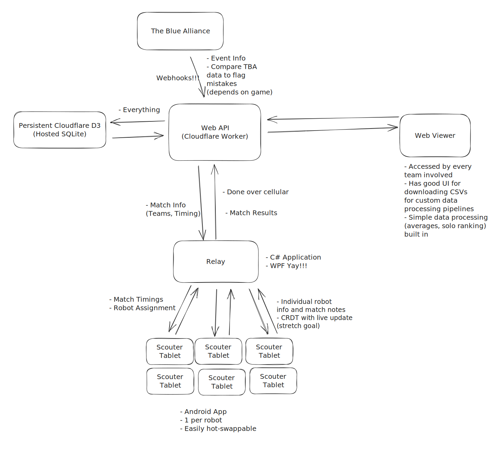

# Setup

## System Diagram

## Local Development

### API

- Copy [.dev.vars.example](api/.dev.vars.example) to [.dev.vars](api/.dev.vars)
- Get a thebluealliance key from your [account page](https://www.thebluealliance.com/account)
- Generate a new JWT secret (or use the one in the example file) with `openssl rand -base64 32`
